            
            
index.html==>微营销服务         introdation
            
            <h3 class="ds-col">专业的电商服务，专业的电商平台。</h3> 
            
协助中小企业低成本、高效率地快速开展电子商务业务。

            <!--
-->
            <!--
移动会员与优惠券云<a href="huiyuanzhushou.html"><button class="btn1">快速了解</button></a>
-->
            <!--
移动培训+学员秀平台<a href="huiyuanzhushou.html"><button class="btn1 btn-ml1">快速了解</button></a>
-->
            <!--
微商城云<a href="huiyuanzhushou.html"><button class="btn1 btn-ml2">快速了解</button></a>
-->
            <!--
-->
            

            
移动会员与优惠券云

            
移动培训+学员秀平台

            
微商城云

            

             

                 <!--
<a href="huiyuanzhushou.html" >快速了解</a>
-->
                 <!--&lt;!&ndash;<button type="button" class="btn btn-default btn-block">快速了解</button>&ndash;&gt;-->
                 <!--
<a href="yidongpeixun2.html" >快速了解</a>
-->
                 <!--
<a href="#">快速了解</a>
-->
            <a href="hyzs.html"><button class="btn1">快速了解</button></a>
            <a href="yidongpeixun2.html"><button class="btn1">快速了解</button></a>
            <a href="weishangyun.html"><button class="btn1">快速了解</button></a>
             

            

            

            
企业宗旨：我们提供服务，企业提升业务。

            
==>定制开发       
	

            <h3 class="ds-col">定制开发，让产品在追求完美上越走越远！</h3> 
            
如果你还有要求，那我们也可以帮你实现。

            

                
B2B/B2C移动商城、跨境电商、移动餐饮系统、社区O2O电商、全平台电商、移动商城导购、O2O团购.......这些类型的电商项目我们都做过。
  
            

            
开发特色专属企业的电商平台，请立即咨询我们。<a href="lianxiwm.html"><button class="btn1 btn-ml3">快速了解</button></a><!--<a href="#" class="block1-btn1">立即咨询</a>-->

        

        

            
        

        

==>解决方案
		
    

        

            
        

        

            <h3 class="ds-col">让我们成为电商平台开发的给力推手！</h3> 
            
项目需求不清楚，业务逻辑不清晰。那先看再做。

            

                
电商移动软件

                
电商微网站

                
电商网站

            

            

            
如果还有什么不明白，欢迎咨询我们。<a href="weishangyun.html"><button class="btn1 ">快速了解</button></a><!--<a href="#" class="block1-btn2">立即咨询</a>-->
  
            

        

    

    
    
         <section id="Service" style="background:#f4f4f4">
            

                

                    

                        <!--<h1>Enterprise&nbsp;Service</h1>-->
                        <!--<h3 class="nav_bg">企业服务</h3>-->
                        
 迈峰网络科技秉承“以用户为中心”的企业理念，坚持“诚信创新、追求卓越”的核心价值观，拥 有一支技术精湛、经验丰富、紧跟IT新技术、新应用的专业团队（研发人员占比超过90%），公司以优 秀的设计理念、深厚的技术底蕴以及独特的用户体验设计，为用户提供优秀的移动互联解决方案，与客 户共同成长,并积累了多项成功案例。
                        

                        
 迈峰网络团队秉承积极进取、团结务实的优良传统，崇尚创新、高效的互联网文化，打造平等、轻 松的伙伴式工作氛围和出色的执行力，享受移动互联网时代技术与服务的美妙为每位员工的学习、发展 与提升提供一个优质平台，享受与技术、产品与设计。
                        

                    

                    

                        
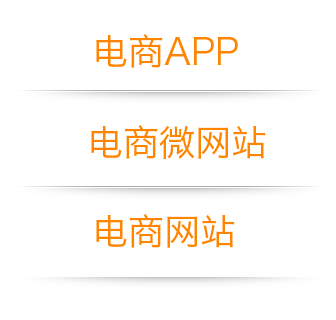

                    

                    

                        
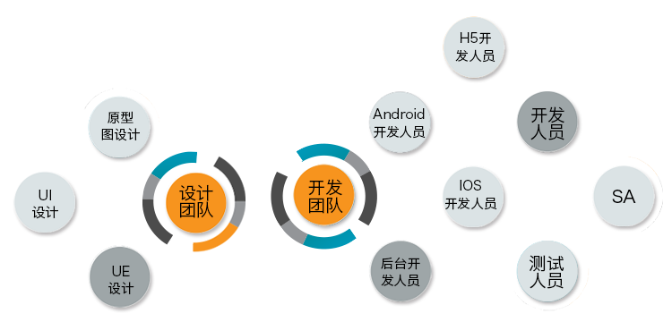

                    

                

            

        </section>
    
    
      <section id="Cases" class="text-center">
            

                

                    

                        <h1>Successful&nbsp;Cases</h1>
                        <h3 class="nav_bg">成功案例</h3>
                        <h4>让我们一起拥抱移动互联时代</h4>
                    

                    

                        

                            

                            
<a href="Quanpingtai.html">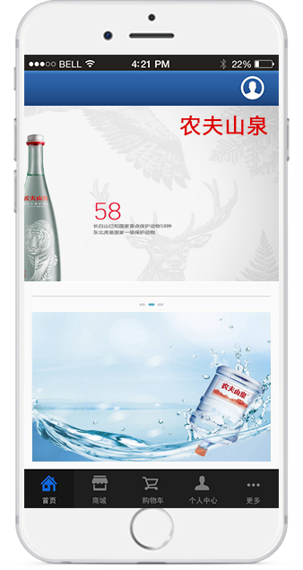</a>

                            
<a href="KuaJingDS.html">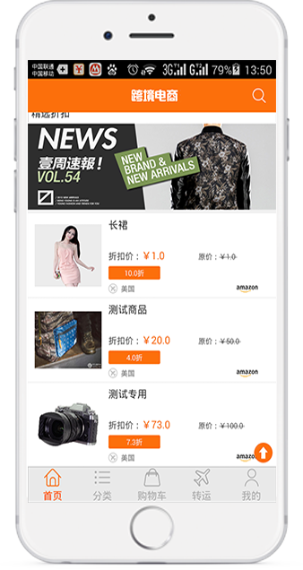</a>

                            
<a href="shequO2O.html">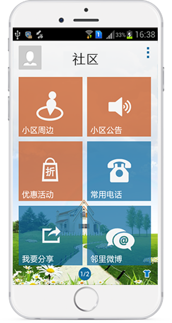</a>

                            
<a href="B2C.html">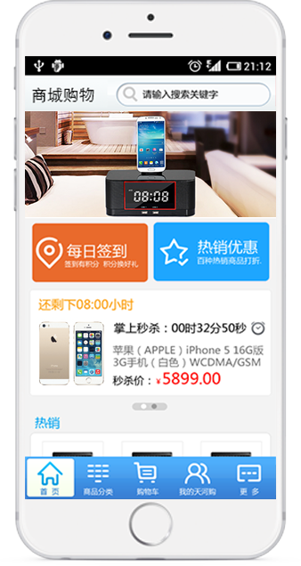</a>

                            
<a href="O2O.html">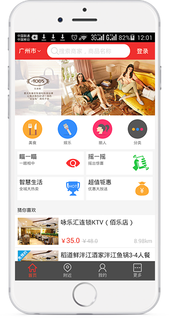</a>

                            
<a href="SheJiao.html">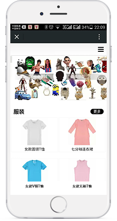</a>

                        

                    

                

            

        </section>

     
		 <!--<section id="solution" class="features text-center">
            

                

                    

                        <h1>The&nbsp;solution</h1>
                        <h3 class="nav_bg">解决方案</h3>
                        

                            <ul class="tab_menu">
                                <li class="selected">电商APP</li>
                                <li>电商微网站</li>
                                <li>电商网站</li>
                            </ul>
                            

                                

                                    
APP-iphone、Android系统等智能手机的第三方应用程序

                                    

                                        
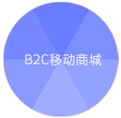

                                        <i>多元化电子商务服务支持
                                            的电子商务平台，商家入驻进
                                            行商品管理、店铺管理、订单
                                            管理、存储管理、促销推广、
                                            售后服务和结算管理。用户在
                                            商城进行分类选择和搜索，查
                                            看购买所需的商品。适用于拥
                                            有大量消费者资源,想要把消费
                                            者价值最大化的企业，具有平
                                            台运营能力的企业。
                                        </i>
                                    

                                    

                                        

                                        <i>
                                            跨地区进行产品自售和品牌代购，通过海外采购，管控同供货商的供货价格，完善的报税仓储管理和报关出货的业务系统。实时的物流执行和状态反馈，通过多平台产品和在线支付让用户更快更好的进行消费。
                                        </i>
                                    

                                    

                                        

                                        <i>
                                            餐饮企业手机客户端可以向用户提供手机点餐、在线预约、线路导航、优惠推送、一键呼叫和手机定位等功能。服务每一位到场就餐的用户，同时专业的派送团队，完善的用户评价系统累积收集用户的习惯爱好、评论和意见，有效提升服务质量和餐厅管理。
                                        </i>
                                    

                                    

                                        
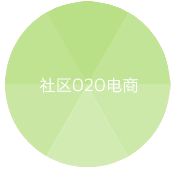

                                        <i>
                                            面向用户提供信息 发布与分享服务、社区信息服务和社区微博服务三大服务。包括三大核心平台功能“基础微博平台、周边信息管理和社区信息管理模块”，主要有附近商家信息、优惠信息和他人分享的图文信息，社区管理员可以进行社区管理和公共发布，用户参与社区话题获取身边的商户信息和最新资讯。
                                        </i>
                                    

                                    

                                        

                                        <i>
                                            支持APP端（Android/ios）、PC端、web端和后台管理系统的数据同步，借助现有资源和第三方服务，搭建互动平台，进行商品管理和发布最新促销活动，同时用户可以通过不同平台获取信息。更好的帮助商家进行用户管理和营销推广。
                                        </i>
                                    

                                    

                                        

                                        <i>
                                            凭借与企业合作共赢，方便更多的智能手机用户买到实惠，玩的开心，提高用户的手机享实惠的体验 ，APP帮助商家发布最新促销活动、提供优惠商品电子券下载，商家地理位置呈现，对商家进行分类展示、通过关键词或区域位置搜索到促销商品、商家信息，给热销产品及商家旗舰提供了一个展示的平台。
                                        </i>
                                    

                                    

                                        
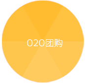

                                        <i>
                                            O2O团购客户端集浏览、支付、消费和无线wifi等一体化服务的的移动应用程序。主要从餐饮、娱乐和生活需求中给用户带来更加便捷的享受和更好的用户体验。实现发布最新需求信息、促销活动、提供网购咨询，进一步提升团购服务的质量。
                                        </i>
                                    

                                    

                                        
敬请期待

                                        <i style="display: block;text-indent:0;margin-top:30%;cursor: pointer;">
                                            <a href="lianxiwm.html">立即咨询</a>
                                        </i>
                                    

                                

                                

                                    

                                        微信开发即微信公众平台开发，将企业信息、服务、活动等内容通过微信网页的方式进行表现，用户通过简单的设置，就 能生成微信3G网站。通过微信公众平台将企业品牌展示给微信用户，减少宣传成本，建立企业与消费者、客户的一对一互动 和沟通，将消费者接入企业CRM系统，进行促销、推广、宣传、售后等。
                                    

                                    
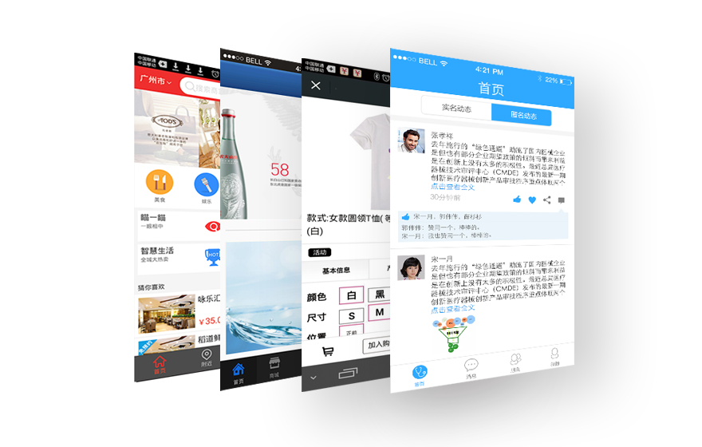

                                

                                

                                    

                                        随着网络的发展，供求双方在网上直接沟通，在网上看样品、谈价格、签合同、支付货款等，企业与企业间的订货、销售、 发货等全部交易行为均以电子商务的方式进行。而随着电子商务这种新型的商业运营模式的兴起，电子商务为企业与企业间创造 了实现消费需求的新机会，为任何一种商品都带来了最直接的了解与周转渠道。而相较于传统运营模式所存在的种种弊端，电子 商务则在企业经营上带来了不少的优势。
                                    

                                    
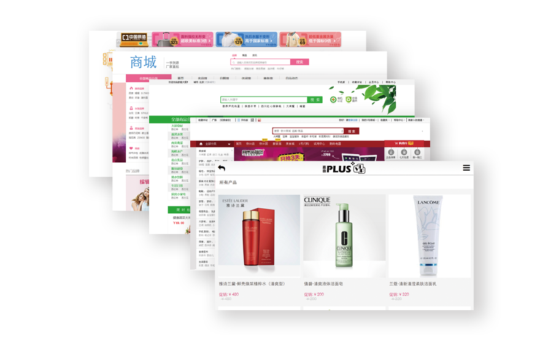

                                

                            

                        

                    

                    

                    

                

            

        </section>-->
        

/*/*800px*/
			
			.tabs {
				border: 1px solid #222222;
				border-radius: 5px;
			}
			
			.tabs .introduction_es p,
			h3 {
				text-align: center;
				margin-bottom: 7%;
			}
			
			.tabs .introduction_es span {
				display: block;
				text-align: center;
			}
			
			.tabs .introduction_es a {
				display: inline-block;
				width: 12%;
				margin: 2% 5%;
			}
			
			.tabs .introduction_es a img {
				width: auto;
				max-width: 100%;
			}
			
			.tabs .introduction_es .consult_icon {
				text-align: right;
			}
			
			.block1 {
				padding: 3%;
			}
			
			.tabs ul {
				padding: 0px !important;
				margin: 0px;
			}
			
			.tabs:first-child {
				margin-left: 13%;
			}
			
			.tabs ul li {
				margin: 0px;
				padding: 0px !important;
				border-top: 1px solid #303030;
				border-right: 1px solid #303030;
				text-align: center;
			}
			
			.tabs ul li:last-child {
				border-right: 0px;
			}
			
			.Product_Server .product_title {
				text-align: center;
				margin: 2.5% 0;
			}
			
			.Product_Server .product_title span {
				font-size: 2.4rem;
				font-weight: 500;
			}
			
			@media only screen and (min-width: 310px) and (max-width: 480px) {
				.block1 {
					padding: 2%;
				}
				.tabs {
					margin: 2.5% 0 5% 9%;
				}
				.tabs:first-child {
					margin-left: 9%;
				}
			}*/